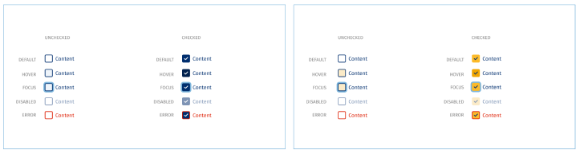
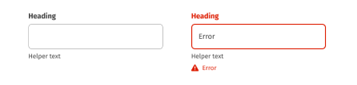
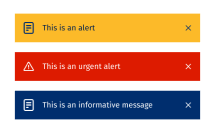
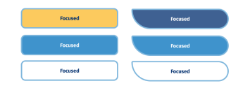
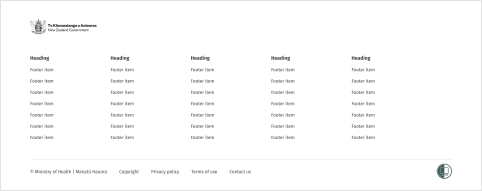

### [0.0.64-beta.3](https://gitlab.com/alphero/moh-design-system/compare/v0.0.64-beta.2...v0.0.64-beta.3) (2022-09-22)

### [0.0.64-beta.2](https://gitlab.com/alphero/moh-design-system/compare/v0.0.64-beta.0...v0.0.64-beta.2) (2022-09-22)

### 0.0.64-beta.0 (2022-09-22)

### Features

* generate component docs ([0a6c185](https://gitlab.com/alphero/moh-design-system/commit/0a6c1855548a52394f339915df74023df7196562))

### Bug Fixes

* fix syntax of all rules ([6e68f8f](https://gitlab.com/alphero/moh-design-system/commit/6e68f8f48b58a525ccf786426073a9c4d55ae31e))
* installed published version of themes ([ed334af](https://gitlab.com/alphero/moh-design-system/commit/ed334af7d48d8219b4bc712ce97bcd45701ca9c5))
* remove dry run flags ([14c1dc4](https://gitlab.com/alphero/moh-design-system/commit/14c1dc4187a3460b60fb312d3d7e020225efd8ba))
* run install & build on all rules ([bb95dc2](https://gitlab.com/alphero/moh-design-system/commit/bb95dc25a28323f020e9b96aca9ab6cacf0cb06d))
* skip git pre-commit hooks ([f0195f3](https://gitlab.com/alphero/moh-design-system/commit/f0195f319367e262d77e032cbdb657d11d4a492d))
* update CI pipleines ([e39cd6d](https://gitlab.com/alphero/moh-design-system/commit/e39cd6df435439c7cb28d2eeae9881c93aaf1054))
* update lock file ([558df19](https://gitlab.com/alphero/moh-design-system/commit/558df1975b038f5d3e7de0343cc9f1665d09d4c1))
## v1.1.0 (2022-05-04)
### What's new?
  Tēnā koutou beautiful people,
  
  Miro and I have just published version 1.1 of the pattern library for all 3 libraries (MCR, MHA and Neutral).
  
  Please swap your files to consume the latest version of the libraries in Figma following this guide:
  
  Swap style and component libraries – Figma Help Center (I’ve also attached Alphero’s simple diagram as a PDF).
  
  The original libraries will remain published for the time being, but they are now out of date. If you need a hand swapping libraries, feel free to sing out.
  
  What’s new?
  
  **We’ve updated the checkbox styles:**
  
  Checkbox styling has been updated using the tokens in a way that allows the My Health Account library to use the yellow accent colour. This also matches the style we are happy with in CISS and RATs and injects a tiny amount of personality into them via rounded corners.

  

  **We’ve removed dropshadows removed from all text inputs:**

  Dropshadows have been removed from all input fields as we discovered once we started using the library that most of the team currently use the input fields on a white background. If there’s a need, we can add it back in later as an option you toggle on or off.

  

  **We’ve added new banner styles:**

  A new announcement Banner component has been added. The component can already be found in production via My Covid Record and the COVID-19 Health Hub and it consists of 3 variants - Alert, Information, and Urgent. The component features an icon and text and can optionally be dismissed.

  

  **We’ve changed the focus states (on buttons and text links):**

  The focus state colour and thickness has been updated. It's modelled after the focus styles used across My Covid Record (also mentioned above), but we will begin to roll this out across all apps for improved accessibility and consistency.

  

  **We’ve updated the footer:**

  We have updated the layout and spacing in the footer. The same variant options are available (no social/social icons, 0-5 columns, mobile/desktop, light/dark)Discussions are underway around potentially creating a universal version that includes content so that we are able to provide all MOH apps with the exact same footer, uniting all products to feel like they are a part of the same site. That is currently in concept/discovery phase.

  

  **We’ve added paragraph spacing to the type styles:**

  We have added paragraph spacing to the type styles for when longer pieces of text are in use. This is applied at the token level, so it can be a variable that we change per library.

  **Focus on accessibility:**

  We’ve also made some minor tweaks to the error and focus states across several components to improve accessibility (simply making the border wider on error, and changing the focus state to blue to match our MCR style which we’re adopting universally, but may not yet apply to every component).

  We’d love to hear from you if you have any feedback or requests, or if you just want to korero about the library.
  
  Ngā mihi nui,
  
Alex
